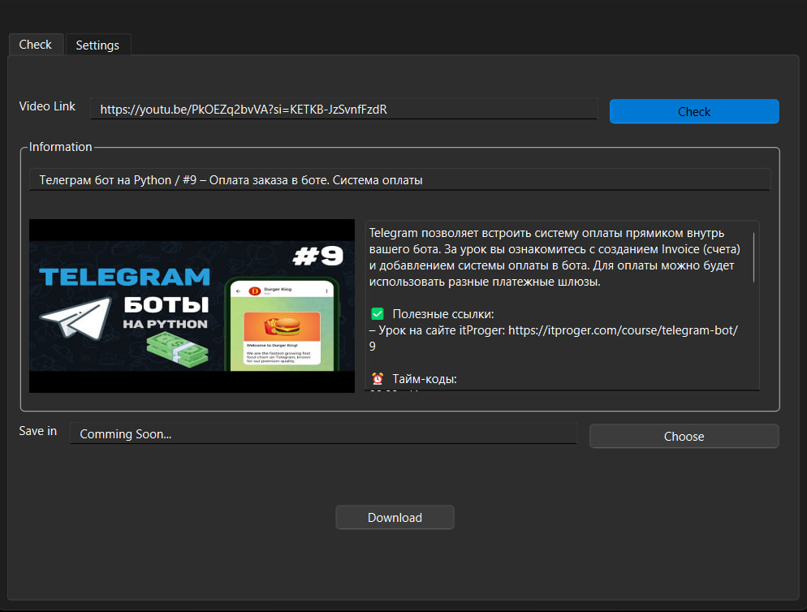

<h1 align="center">Youtube Downloader App </h1>
<h4 align="center">
  <a href="https://t.me/horekisun">Telegram</a>
  |
  <a href="https://github.com/TheDmitryY/YTDownApp#-installation"">Installation</a>
</h4>

<p align="center">


Youtube Downloader - is a application that help to download YouTube videos for free.
</p>

## Preview📷



## ✨ Features

- Fast downloading
- Comfort interface
- Free application
- More updates soon

## 🤖 Installation
<h2> Windows </h2>

```
git clone https://github.com/TheDmitryY/YTDownApp

cd YTDownApp

Open setup.bat 
```
<h2> Linux </h2>

```
git clone https://github.com/TheDmitryY/YTDownApp

cd YTDownApp

chmod +x setup.sh

./setup.sh
```

